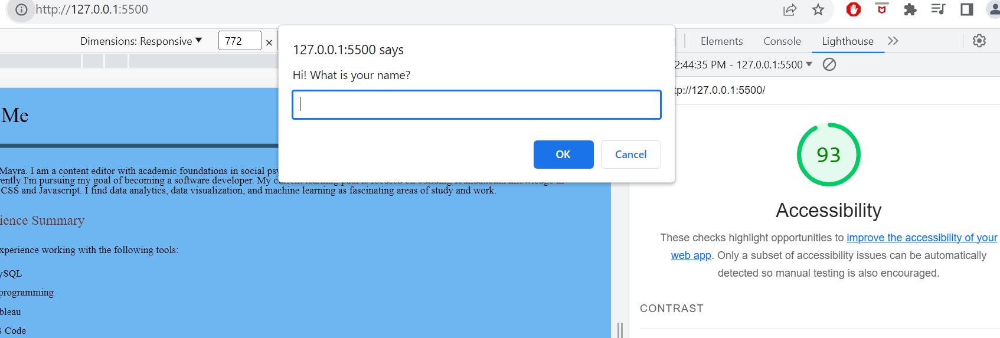

# LAB - Class 2

## “About Me” project

I built an “About Me” webpage that quizzes the user on fun facts and gives the user some basic information about who I am.

### Author: Mayra C

### Links and Resources

* [Project GitHub link](https://github.com/mayracu/about-me/tree/main)

### Lighthouse Accessibility Report Score

### Reflections and Comments

* I enjoyed putting in practice the concepts and topics covered in the lesson such as loops, conditional statements, variables, CSS and HTML.
